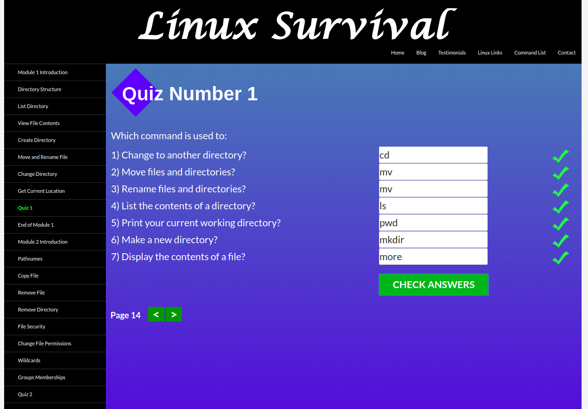
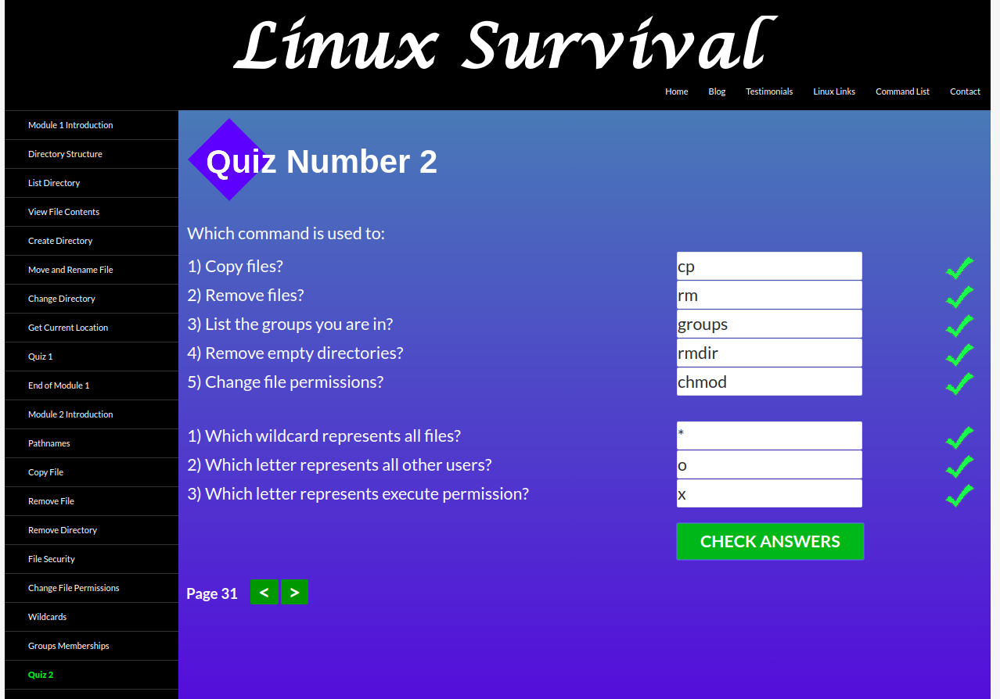
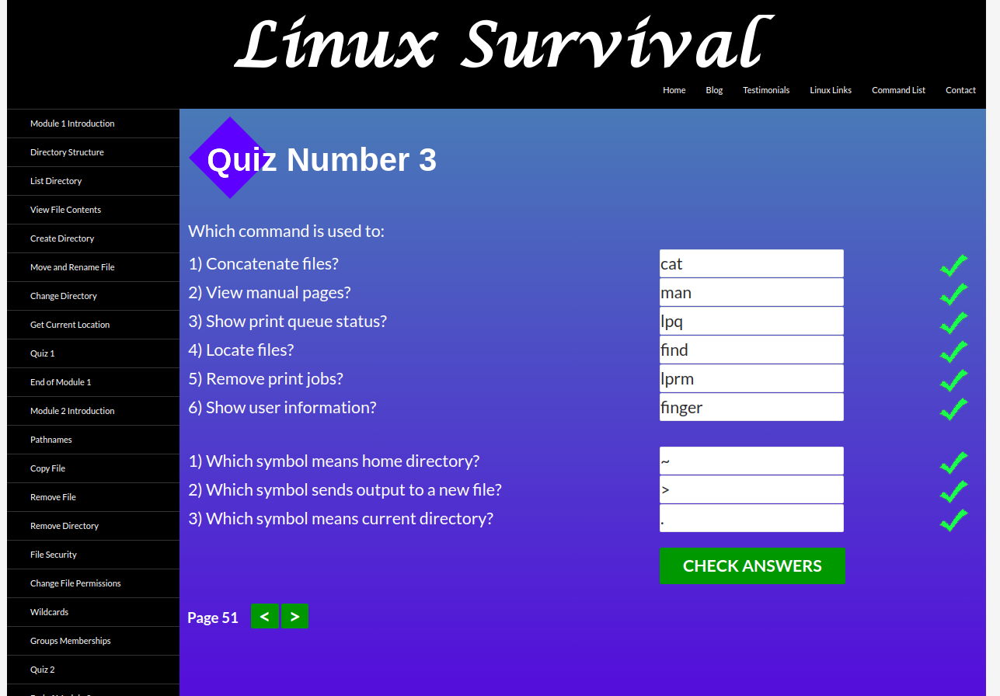
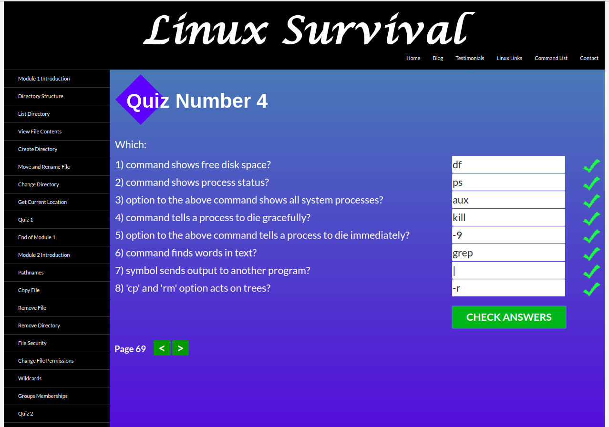
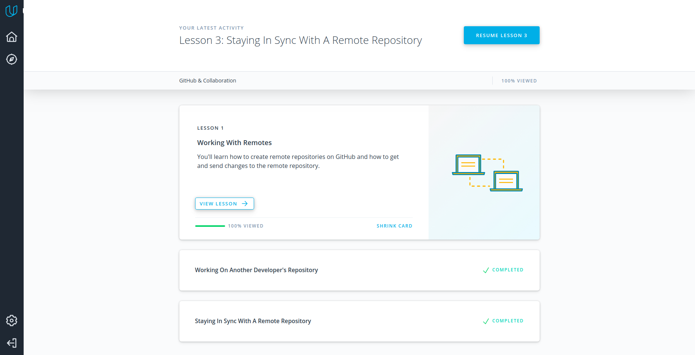

# kottans-backend
##Git and Github Intro 
Udacity Git course was really interesting and and totally understandable for me. I had learnd Git before this course, but it wasn't so structured. This course gave me understanding how Git work and how is in the process of making a commit.

##Unix Shell
I had learned Unix Shell before this course and I often use shell, so most of the information isn't new to me. Nevertheless, I knew some new commands such as aus, df, lpq and lprm. It was useful for consolidate my knowledge and know something new. And of course, I will use this (old and new) information in the future.

## Git Collaboration
Udacity GitHub & Collaboration course's incredibly interesting and useful course about GitHub.
I learned a lot of necessary information for me(interaction with remote repository, creating  Pull Requests, squashing). Now my working with GitHub will get much easier.

